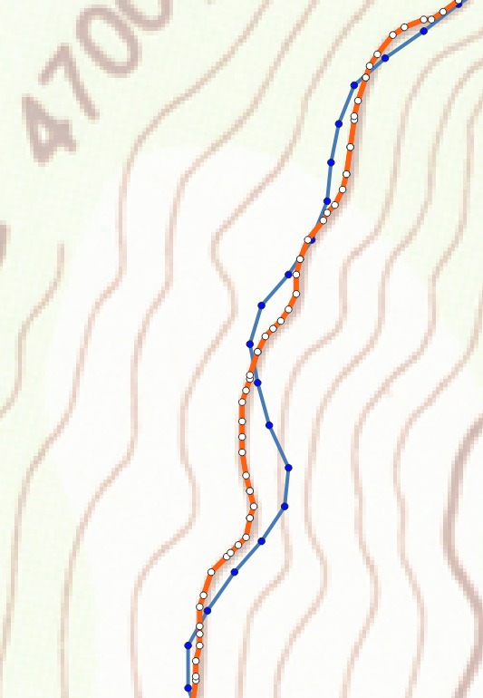

# Lineman

**A tool for aligning GeoJSON linestrings to bitmap images.**

Program by Thomas C. van Dijk†. Lehrstuhl für Informatik I, Universität Würzburg.

Joint work with Yao-Yi Chiang and Weiwei Duan of USC Dornsife Spatial Sciences Institute.

*† Supported by DFG grant Di 2161/2-1 in the priority programme Volunteered Geographic Information.*

## Description

Lineman is a tool for aligning geographic polylines to bitmap images. Currently it supports GeoJSON, PNG and (Geo)TIFF. The computed alignment is optimal according to our hidden Markov model. Note that the program and model are work in progress; the user interface, file formats, and computed solution may change. Contact us at `thomas.van.dijk@uni-wuerzburg.de` if you have any questions already. For just playing around, have a look at [a short video](https://www.youtube.com/watch?v=Y9-8p9PRXys) or try: 

```align --help```

Here is an example usage of Lineman and a visualisation of input (blue) and output (orange) in QGIS.

```align --subdivide=2 bray.tif isoline.geojson -o fixed.geojson```



## Code

Lineman is written in C++17 and is known to compile using recent versions of Visual Studio. Linux and Mac support is expected, but has not yet been tested. Courtesy copies of the following libraries are supplied in this repository.

* docopt
* LodePNG
* RapidJSON

The following additional libraries are required to build Lineman. The `vcpkg` package manager is known to provide functional versions in Visual Studio.

* libgeotiff
* spdlog

You may need to compile with `DOCTOPT_USE_BOOST_REGEX` (note the T in docTopt) if your compiler's `std::regex`  is poor; in that case, you additionally require:

* Boost Regex

## License

For our code, see the LICENSE file.
Note that the included copies of docopt, LodePNG and RapidJSON fall under their own license.